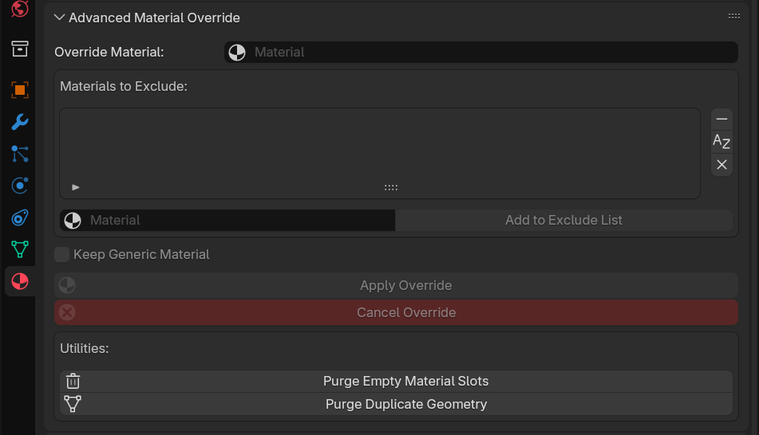

# Advanced Material Override Addon

## Description

The Advanced Material Override addon provides dynamic material overrides with an exclude list in the Material Properties panel for Blender.

## Features
- Dynamically override materials for all objects in a scene.
- Exclude specific materials from being overridden.
- Stores original materials for persistence across sessions.
- Extra button to Clean unused material slots for better user experience after imports.

## Installation
1. Download the addon.
2. Open Blender and go to `Edit > Preferences`.
3. Click on `Add-ons`, then click `Install...`.
4. Select the downloaded addon file and click `Install Add-on`.
5. Enable the addon by checking the checkbox next to `Advanced Material Override`.

## Usage
1. Go to `Properties > Material Properties`.
2. Set the override material.
3. Add materials to exclude from the override.
4. Click `Apply Override` to apply the override material.
5. Click `Cancel Override` to restore the original materials.
